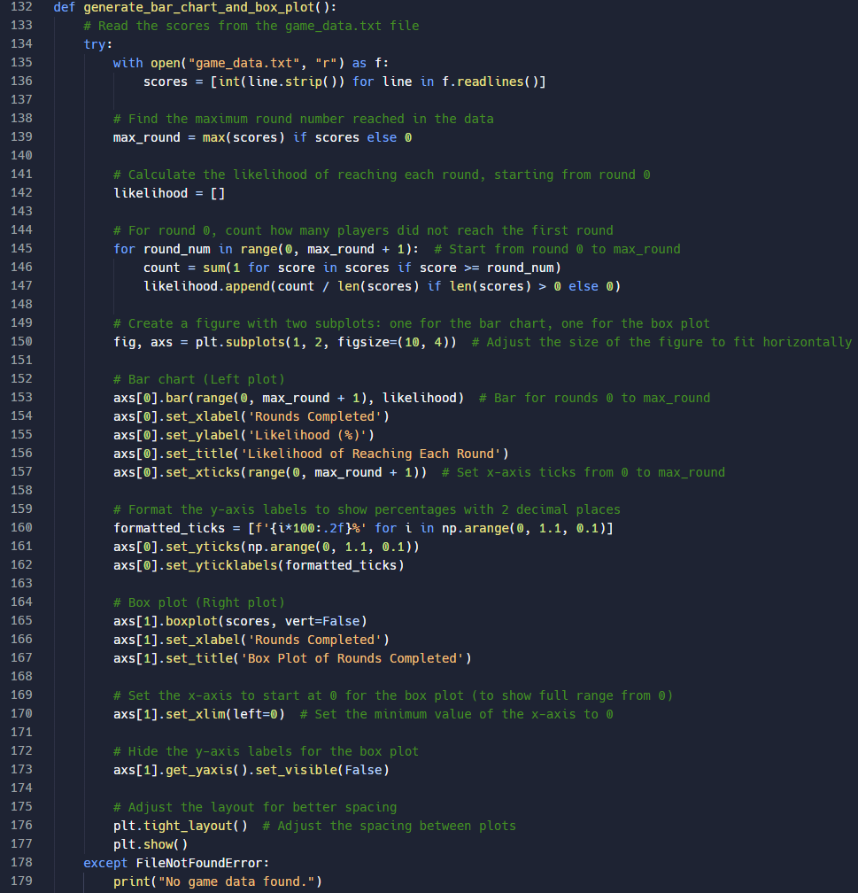

## Importing different modules we use throughout our project.

## Something chatgpt uses to initialize pygame, to run the game.

## Setting the colors we use in the game.

## Setting the game window and name of the game.

## Placing the circles and their respective colors.

## Function to darken the circles when hovering over them.

## Setting the font and size we want to use in our game.

## Used to control the frame rate.

## Creates random choice of circles, based on a particular length.

## Chatgpt helps create the visual sequences and the darkening of the colors that need to be repeated by the player. the handling of users' clicks are dealt with.

## A function to check if the players' color choices match the game's colors.

## Chatgpt created a start button, game over screen, and made the start game button darker when hovered over.

## Made a function that creates a bar chart and box plot with the running results of the games, to see overall statistics.

## Chatgpt made a gameplay loop to run the game, involving:
## - launching window
## - showing start button
## - randomly selecting colors
## - deciding whether or not the actual colors match the player's colors
## - continue the game if the player is right
## - showing game over screen if the player is wrong
## After the game ends, an updated bar chart and box plot is shown to the user.

## Created by chatgpt to initialize the game.

### Live demonstration: [Run on Replit](https://replit.com/@blackmja/Project?v=1)
